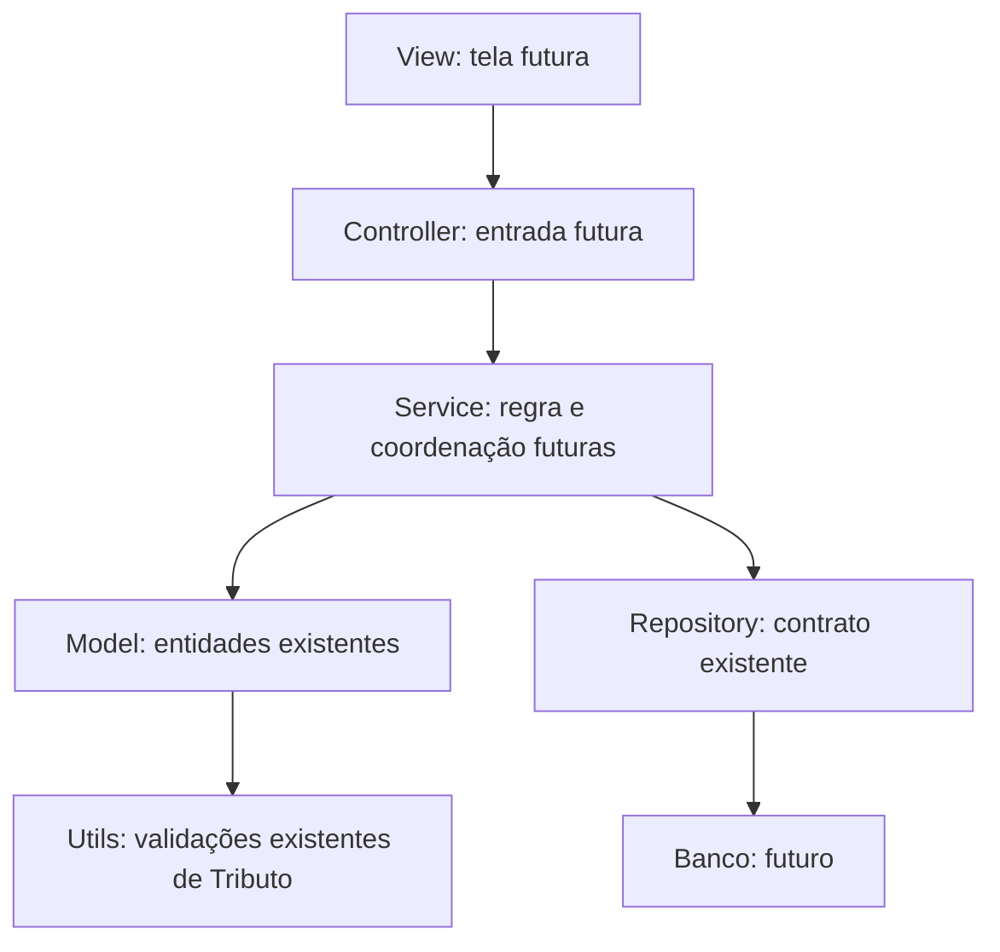

# MVC e camadas, sem complicação

MVC separa Model (dados e comportamento de domínio), View (apresentação) e Controller (entrada e coordenação da solicitação).

**O projeto atual é um backend organizado em camadas. Ainda não é um MVC completo:** não há View nem Controller. A pasta models contém entidades, mas o conceito de Model no MVC pode abranger também regras e acesso aos dados.

| Papel | Exemplo simples | Situação no projeto |
|---|---|---|
| View | Formulário em que a pessoa informa um tributo | Planejado; pasta ainda inexistente |
| Controller | Recebe a solicitação, chama serviço e devolve resposta | Planejado; pasta ainda inexistente |
| Entidade | Tributo guarda nome, categoria e alíquota | src/models |
| Service | TributoService coordena o cadastro | Contrato em src/services |
| Repository | TributoRepository procura e salva dados | Contrato em src/repositories |
| Utils | Validação reutilizável de texto e Decimal | src/utils |

main.py é apenas um ponto de entrada demonstrativo; não é um controller.

## Uma funcionalidade não precisa caber em uma classe
“Cadastrar tributo” pode usar Tributo, TributoService e TributoRepository. Elas colaboram, mas não repetem o mesmo trabalho:
- Tributo representa um tributo e rejeita campos básicos inválidos.
- TributoService deverá coordenar o cadastro e tratar duplicidade.
- TributoRepository deverá acessar o armazenamento.

Usuario e Perfil ficam no mesmo arquivo porque o perfil descreve um usuário. Não há regra de “uma classe por funcionalidade” nem limite de duas classes. Separar por responsabilidade ajuda a mudar a forma de salvar sem reescrever cálculos.

**Classe** é uma definição; **objeto** é um exemplar concreto, como o tributo IPTU. **Contrato abstrato** lista operações obrigatórias para uma implementação futura; não executa essas operações sozinho.

## Desenho proposto

As setas mostram dependências propostas. Hoje os serviços apenas declaram métodos; a ligação executável com repositórios ainda precisa ser implementada.

## Evite estes equívocos
Não colocar SQL na entidade; não duplicar cálculo na tela e no serviço; não tratar simulação como alteração real; não confundir Historico (evolução de valores) com Log (registro de operações). Compartilhar uma entidade entre serviços é esperado.
