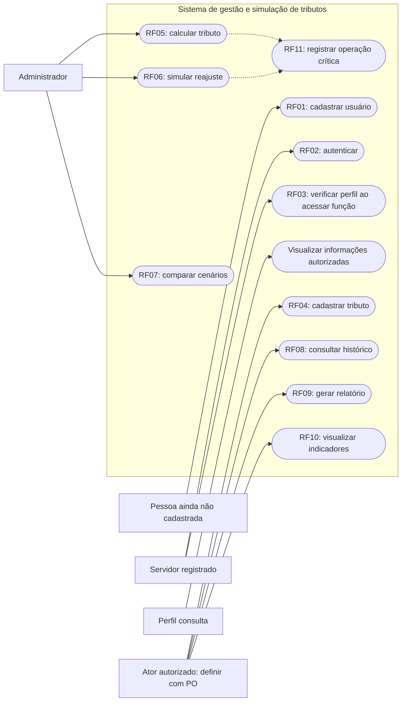

# Casos de uso — o que a pessoa quer fazer

Um ator é um papel que interage com o sistema, não uma classe Python.
As ligações abaixo mostram participação. “Servidor” reúne capacidades comuns;
“Administrador” e “Consulta” são perfis. Esta é uma representação didática dos
casos de uso com Mermaid flowchart, não um diagrama UML formal.

**Todos os casos de uso completos estão planejados.** As validações existentes
de Tributo são apenas uma parte do RF04.

“Ator autorizado: definir com PO” é um marcador de decisão pendente, não um
novo perfil a implementar. Consulta só visualiza; os requisitos ainda não
detalham sua permissão para cada tela ou exportação. Logs são uma ação interna,
não um objetivo que a pessoa precisa disparar manualmente.

## Especificação resumida
| Caso / RF | Pré-condição | Resultado esperado | Erros ou alternativas a tratar |
|---|---|---|---|
| UC01 / RF01 | Dados de cadastro informados | Usuário cadastrado com confirmação | E-mail inválido/duplicado, senha fora da política |
| UC02 / RF02 | Usuário cadastrado | Credenciais válidas liberam sessão | Credenciais inválidas; sessão ainda sem desenho |
| UC03 / RF03 | Identidade conhecida | Operação permitida conforme perfil | Negação registrada; matriz detalhada pendente |
| UC04 / RF04 | Autorização de cadastro a definir | Tributo com nome, categoria e alíquota salvo | Campos inválidos e duplicidade |
| UC05 / RF05 | Administrador autenticado e dados válidos | Valor calculado conforme fórmula aprovada | Base inválida ou regra ainda não definida |
| UC06 / RF06 | Administrador autenticado | Antes/depois exibidos sem alteração real | Percentual/índice inválido; suporte a índice pendente |
| UC07 / RF07 | Administrador com pelo menos dois cenários | Diferença absoluta e percentual | Cenários incompatíveis e referência zero |
| UC08 / RF08 | Histórico disponível e acesso autorizado | Alterações consultáveis por tributo | Histórico vazio; persistência pendente |
| UC09 / RF09 | Dados suficientes e acesso autorizado | Estimativa por categoria exportável CSV/PDF | Dados incompletos ou erro na exportação |
| UC10 / RF10 | Acesso autorizado | Pelo menos três indicadores atualizados | Dados ausentes; indicadores a definir |
| UC11 / RF11 | Operação crítica disparada | Autor e data registrados | Tratamento de falha no log a definir |

UC é apenas um identificador de caso de uso; RF continua sendo a referência
oficial do requisito. O registro de alteração real de RF08 e o log de negação
de RF03 precisam entrar nas respectivas implementações futuras. Veja
[decisões do PO](../produto.md) e [sequências](sequencias.md).
