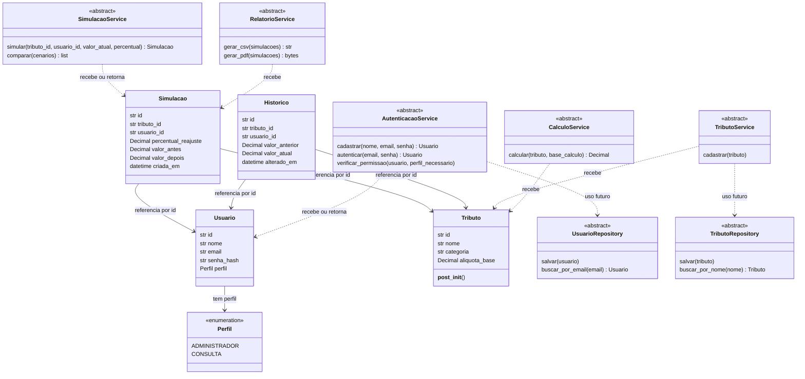

# Diagrama de classes

Classes e campos abaixo existem no código. Métodos dos serviços e repositórios são abstratos. As dependências tracejadas dos serviços para repositórios representam **colaboração planejada**, ainda sem ligação executável. As relações de histórico e simulação expressam referências por id; não são chaves estrangeiras já configuradas.

## Como ler
Uma caixa representa uma classe; a parte interna lista dados e operações. A seta com “referencia por id” significa que um registro guarda o identificador do outro. A seta tracejada indica uso/dependência, não herança. abstract significa que falta uma classe concreta implementar os métodos.

buscar_por_email e buscar_por_nome também podem retornar None. Tipos de coleções foram abreviados para facilitar a leitura; os detalhes estão no [espelho do código](../src/README.md).

Não incluímos View, Controller ou Banco como classes existentes. Funções de validação não são classes: veja [validacoes](../src/utils/validacoes.md). Multiplicidades e integridade das relações precisarão ser definidas quando a persistência for modelada.
