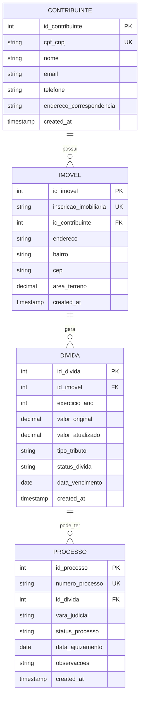

# Diagrama Entidade-Relacionamento (banco SITRIB)

Representa o schema relacional normalizado em `schema.sql`, implementado em SQLite (`sitrib.db`) e populado via `scripts/popular_banco.py`. Cobre o requisito de Parte 2 da Sprint 2 (banco de dados).

## Normalização (3FN)

- Cada tabela representa uma única entidade (contribuinte, imóvel, dívida, processo), sem grupos repetidos (1FN).
- Todo atributo não-chave depende da chave primária inteira de sua tabela — não há chaves compostas, então a 2FN é satisfeita automaticamente.
- Não há dependências transitivas entre atributos não-chave (3FN): por exemplo, `bairro` e `cep` dependem apenas de `id_imovel`, nunca de `id_contribuinte` por tabela intermediária.
- O vínculo "mesmo CPF/CNPJ em múltiplas inscrições imobiliárias" (requisito do grafo de relacionamentos) é modelado pela cardinalidade 1:N entre `CONTRIBUINTE` e `IMOVEL`.

## Relação com o grafo de relacionamentos

Este diagrama descreve a estrutura persistida no banco. O grafo (`src/estruturas/grafo.py`) é construído em memória a partir dessas mesmas tabelas (via `BuscaService._construir_grafo`), navegando `contribuinte -> imovel -> processo` para detectar múltiplas inscrições do mesmo CPF/CNPJ.

[Voltar ao guia](README.md)