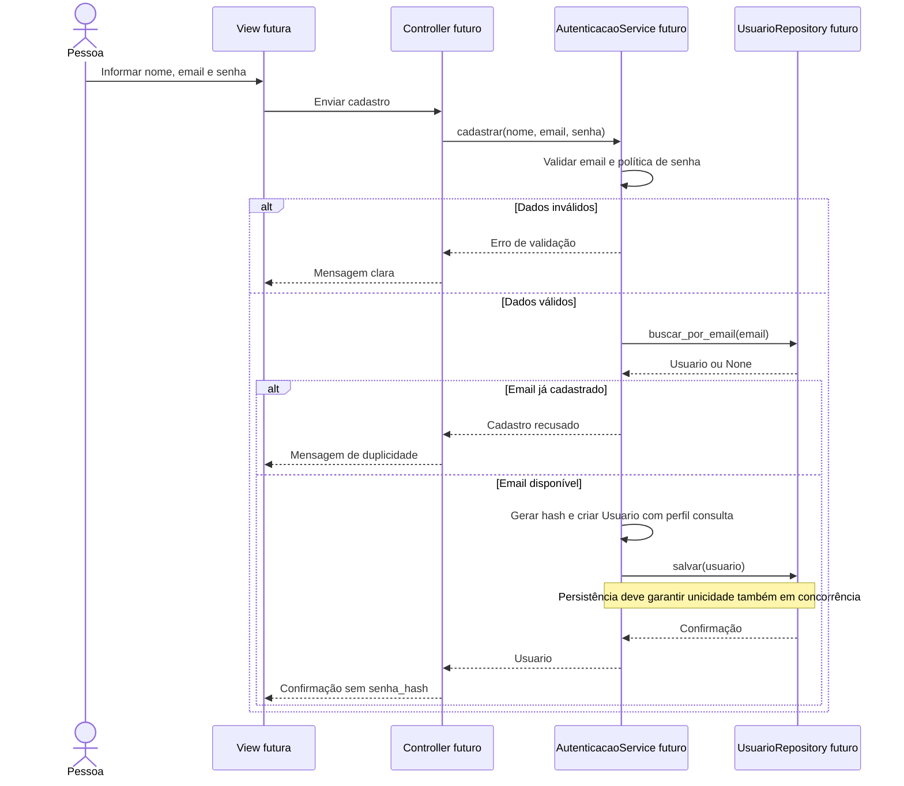
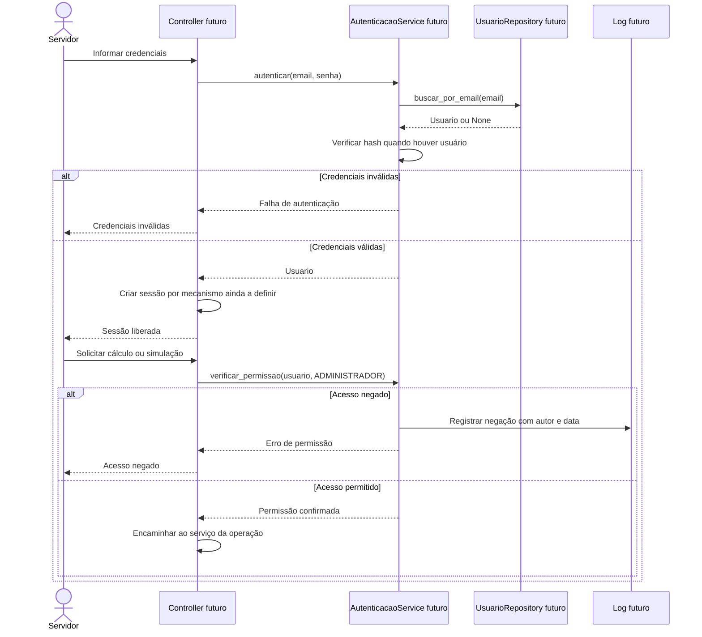
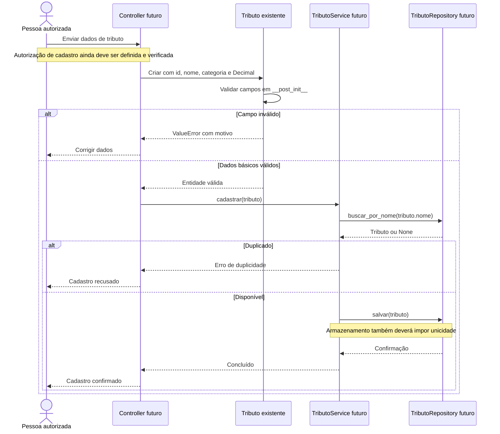
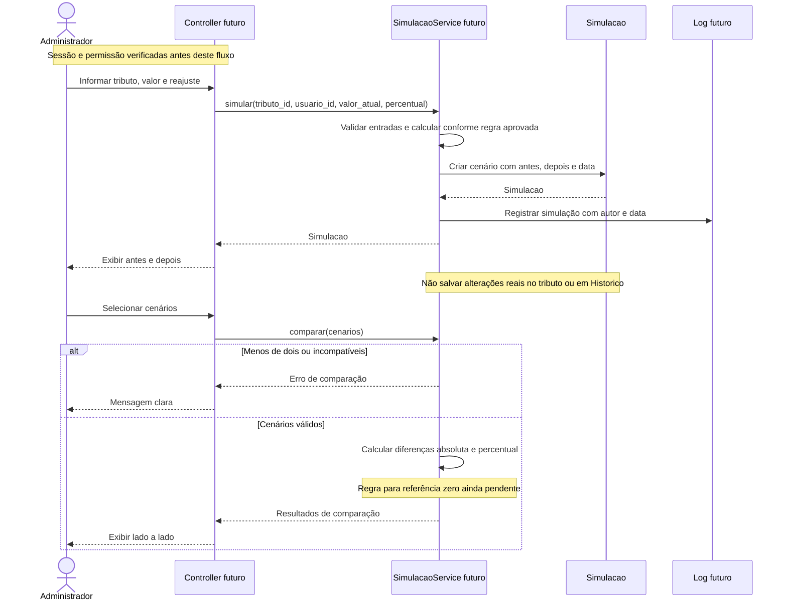

# Diagramas de sequência

Leia de cima para baixo: cada coluna é um participante e cada seta é uma
mensagem. Setas de volta mostram respostas. alt separa caminhos alternativos.

**Todos os fluxos abaixo são planejados.** Hoje só a criação e a validação
básica de Tributo têm execução concreta. View, Controller, banco, sessão,
hashing e Log são participantes futuros. As chamadas descritivas, sem nome
de método Python, ainda não são contratos implementados.

## 1. Cadastro de usuário — RF01

Nunca devolver a entidade completa com hash à tela. Definir posteriormente
o formato da resposta e o tratamento de falhas de gravação.

## 2. Autenticação e autorização — RF02–RF03

Login identifica a pessoa; autorização decide o que ela pode fazer. São
verificações diferentes, mesmo que o contrato inicial as reúna no mesmo serviço.

## 3. Cadastro de tributo — RF04

A entidade não salva a si mesma. O serviço coordena e o repositório salva.
A conversão dos dados da interface para Decimal também precisa tratar entrada inválida.

## 4. Simulação e comparação — RF06–RF07 e RF11

## Fluxos que ainda precisam ser detalhados
- RF05: após autorização, chamar calcular(tributo, base_calculo), tratar entradas inválidas, registrar autor/data e apresentar valor. A fórmula ainda precisa de aprovação.
- RF08: alteração real e gravação do histórico devem ser coordenadas; a persistência e sua transação ainda não estão desenhadas.
- RF09: reunir categorias e quantidades antes de chamar geração CSV/PDF. O contrato atual precisa evoluir para atender essa necessidade.
- RF10: definir as fontes e os três indicadores antes de desenhar a sequência.
- RF11: definir armazenamento do log e comportamento em caso de falha.

Não transformar estes diagramas em código sem resolver as pendências listadas em
[produto.md](../produto.md). Eles orientam a conversa e não comprovam aceitação.
